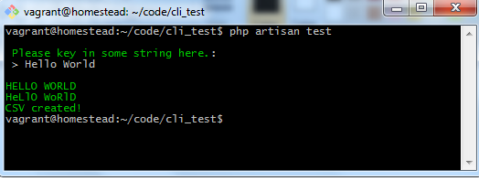
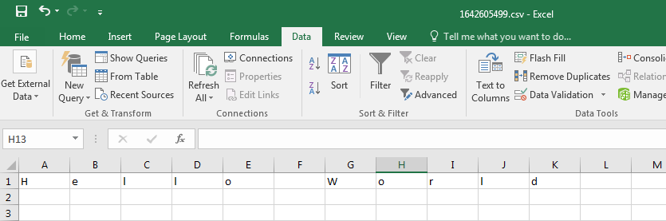

## iPrice Group test assessment

Using object-oriented concepts, create a CLI tool that accepts a string and does the following to it:
- converts the string to uppercase and outputs it to stdout.
- converts the string to alternate upper and lower case and outputs it to stdout.
- creates a CSV file from the string by making each character a column in the CSV and then output  "CSV created!" to stdout.

Setup Laravel
- Requirement:
  - PHP 8.0
  - composer
  - nginx/apache/xampp
- Download from Github and and run cli command below on project folder:-
  - composer install <- This to setup and create library
  - php artisan test <- This to start testing for assemenet
    
  - Noted: csv file will create in folder storage/app/public/_{timestamp}_.csv
    
